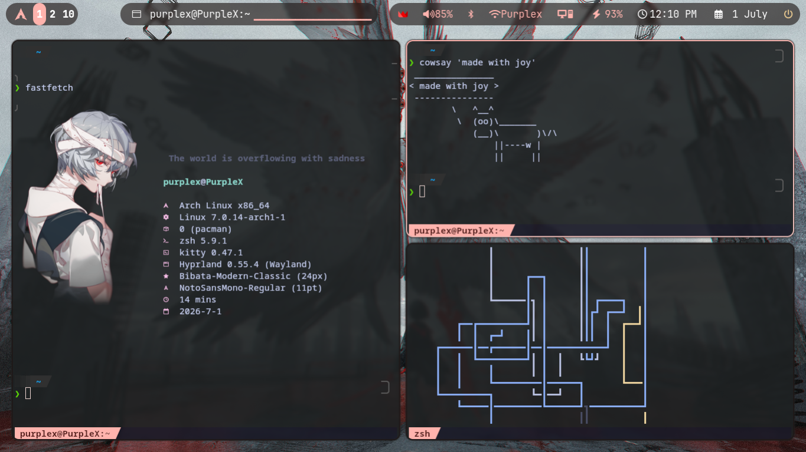
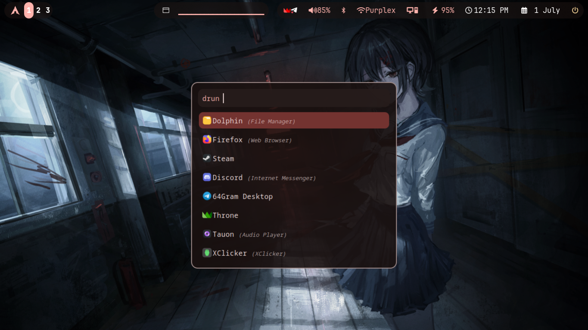
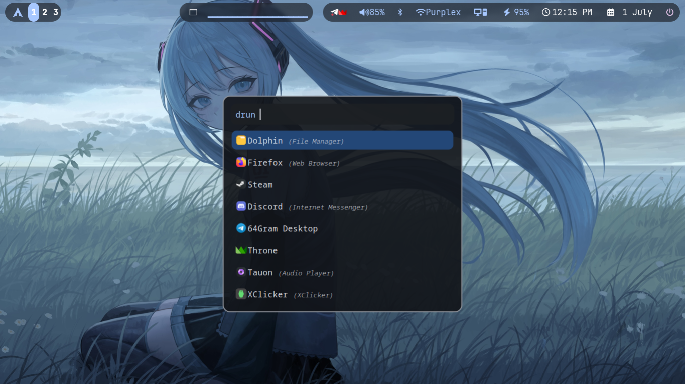
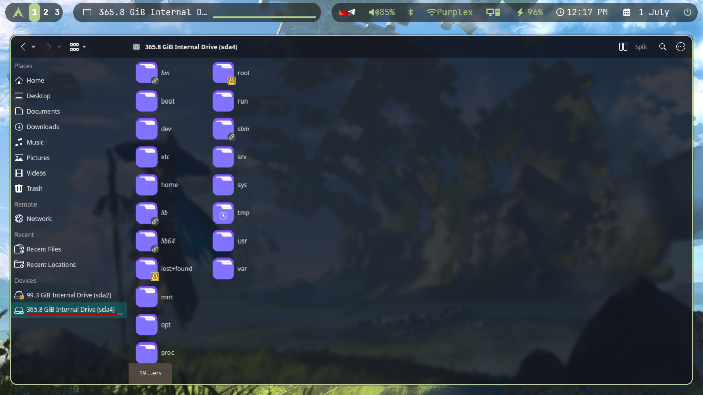
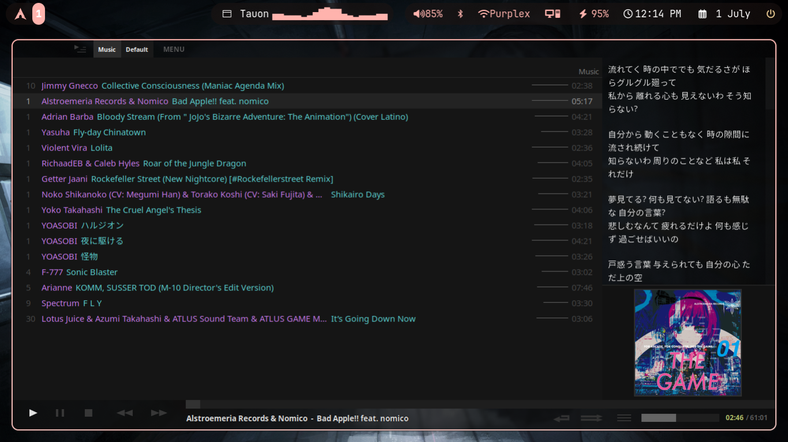

# 🌌 Purple's Gracious Hyprland Rice

[](https://www.reddit.com/r/unixporn/comments/1ukg92j/hyprland_minimalist_no_shell_with_adaptive_theme/)
[-blueviolet?style=for-the-badge&logo=archlinux)](https://hyprland.org/)
[](https://fishshell.com/)

A fully dynamic, Material You-themed Hyprland desktop environment, powered by **Matugen** and configured in **Lua** for maximum customization and zero bloat.

---

## 🖼️ Gallery & Screenshots

<div align="center">
  
  <br/><br/>
  
  
  <br/><br/>
  
  
</div>

---

## 🎨 Features
* **Lua Configured Hyprland:** All window manager configurations are written programmatically in Lua for clean structure and modularity.
* **Dynamic Color Engine:** Pressing `SUPER + SHIFT + W` cycles the wallpaper and triggers **Matugen** to extract a matching Material color palette, instantly styling Waybar, Rofi, Dunst, Kitty, btop, and active window borders on-the-fly.
* **Blazing Fast Shell (Fish + Starship):** Native C++ powered Fish interactive shell with custom Vi keybindings and a sleek Starship prompt.
* **Interactive Waybar Workspace Pill:** Clickable and scrollable workspace navigation directly on the bar.
* **Video Compression Utility (`compress-video`):** Includes a built-in `compress-video` CLI tool using H.265 (`libx265`) to shrink screen recordings by up to 80% without quality loss.
* **Hardware-Accelerated OBS Setup:** Configured for VA-API Intel iGPU hardware encoding (`RecEncoder=vaapi`) for smooth 60 FPS recording with zero CPU overhead while gaming.

---

## 🛠️ Software Stack & Components
* **WM:** [Hyprland](https://hyprland.org/) (Lua backend)
* **Shell:** [Fish](https://fishshell.com/) + [Starship Prompt](https://starship.rs/)
* **Bar:** [Waybar](https://github.com/Alexays/Waybar)
* **Launcher:** [Rofi](https://github.com/davatorium/rofi)
* **Terminal:** [Kitty](https://sw.kovidgoyal.net/kitty/)
* **Notification Daemon:** [Dunst](https://dunst-project.org/)
* **Color Generator:** [Matugen](https://github.com/InioAsgards/matugen)
* **Info Fetcher:** [Fastfetch](https://github.com/fastfetch-cli/fastfetch)
* **Wallpaper Manager:** `awww-daemon`
* **Video Tools:** `ffmpeg` (`libx265`), `obs-studio` (`libva-intel-driver`)

---

## ⌨️ Keyboard Shortcuts (Cheat Sheet)

| Keybinding | Action |
|:---|:---|
| `SUPER + Q` | Open Terminal (Kitty) |
| `SUPER + C` | Close Active Window |
| `SUPER + R` | Open App Launcher (Rofi) |
| `SUPER + E` | Open File Manager (Dolphin) |
| `SUPER + V` | Toggle Floating Mode |
| `SUPER + F` | Toggle Fullscreen Mode |
| `SUPER + B` | Open Clipboard History |
| `SUPER + SHIFT + W` | Cycle Wallpaper & Re-color Desktop (Matugen) |
| `SUPER + S` | Toggle Special Workspace (Scratchpad) |
| `SUPER + SHIFT + S` | Move Active Window to Special Workspace |
| `Print Screen` | Take Screenshot (`rishot`) |
| `SUPER + Mouse LMB` | Drag Window |
| `SUPER + Mouse RMB` | Resize Window |

---

## 🚀 Installation & Setup

1. **Clone the Repository:**
   ```bash
   git clone https://github.com/SudoPurple/purple-s-gracious-hyprland-rice.git
   cd purple-s-gracious-hyprland-rice
   ```

2. **Run the Symlink Installer:**
   This script will safely back up any of your existing configurations in `~/.config` and create symbolic links pointing directly to this folder:
   ```bash
   chmod +x install.sh
   ./install.sh
   ```

3. **Required Packages:**
   ```bash
   sudo pacman -S hyprland waybar rofi kitty dunst matugen fastfetch fish starship cliphist playerctl brightnessctl wpctl ffmpeg libva-intel-driver libva-utils
   ```
